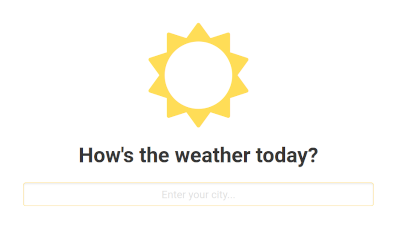

# Rewind the Weather

Don't you wish you could rewind the weather to one week ago, when it was brighter and sunnier?

Unfortunately that's impossible until we have time travel... But how about an application that lets you shop around for the best weather? This application allows you to view weather data from AccuWeather and OpenWeatherMap, letting you pick the weather you enjoy better!

## Screenshots

### Main Page

### Weather Page

## Installation

Follow these instructions inside a bash shell, which should work whether you're running Linux, macOs, or something like Cygwin on Windows.

1. `git clone https://github.com/basimr/rewind-the-weather.git`
2. `cd rewind-the-weather`
3. `virtualenv -p $(which python3) env`
4. `source env/bin/activate`
5. `pip install django requests`
6. `cd weather`
7. `python manage.py runserver`
8. Open http://localhost:8000/ in your web browser
9. Enjoy your weather shopping!

## Notes

* Since the OpenWeatherMap API is not very flexible, use just the city name in the application; for example, use "Ottawa" instead of "Ottawa, ON"  
* In case it is helpful for you to install and run my application, I'm running Ubuntu 18.04
* Based on the given requirements, I assumed:
  * that the application should only support searching for cities
  * that the database schema should be designed to store weather for cities only -- no locations that are considered "not cities"
* In my [database schema](images/database-schema.png):
  * I separarated the `queryDatetime` from `weatherDateTime` to accomodate for the fact that weather forecasts change depending on when they are queried
  * I only included weather data that my application provides: the temperature and a short description of the weather conditions
